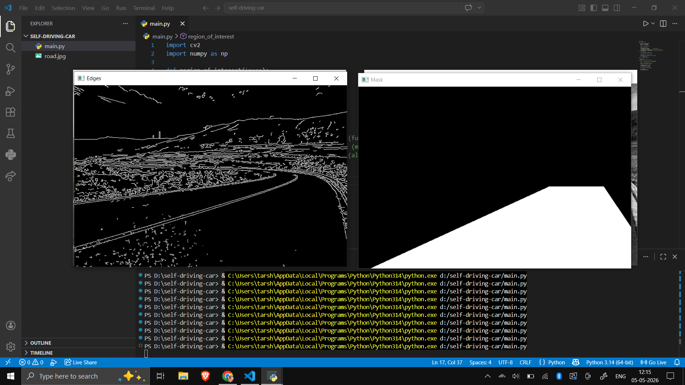
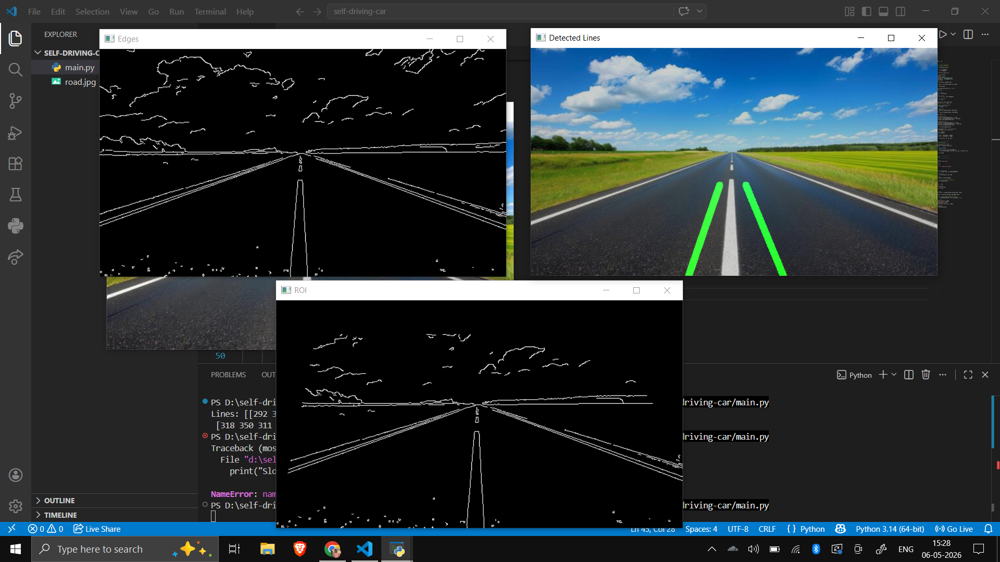
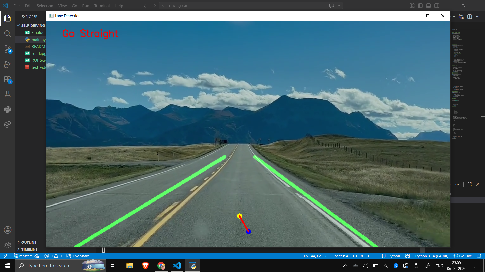

# Autonomous Lane Detection System

## Overview

This project implements a real-time autonomous lane detection and steering estimation system using classical computer vision techniques.

The system processes road video frames, detects lane boundaries, estimates lane center position, and generates steering decisions in real time.

---

## Features

- Real-time lane detection
- Edge detection using Canny
- Region of Interest (ROI) filtering
- Hough Transform lane extraction
- Steering estimation
- Temporal smoothing for stability
- Real-time visualization

---

## System Pipeline

Video Input
↓
Grayscale Conversion
↓
Edge Detection
↓
ROI Filtering
↓
Hough Transform
↓
Lane Averaging
↓
Steering Estimation
↓
Visualization

---

## Technologies Used

- Python
- OpenCV
- NumPy

---

## Screenshots

### ROI Filtering

### Final Lane Detection

### Video Processing

---

## Challenges Faced

- Curved roads reduce lane accuracy
- Lighting changes affect edge detection
- Lane stability required temporal smoothing
- ROI tuning depended on camera perspective

---

## Future Improvements

- Perspective transform (bird’s-eye view)
- Curved lane fitting
- PID steering controller
- Deep learning lane segmentation
- Raspberry Pi deployment

---

## Author

Tarsh Mehta
